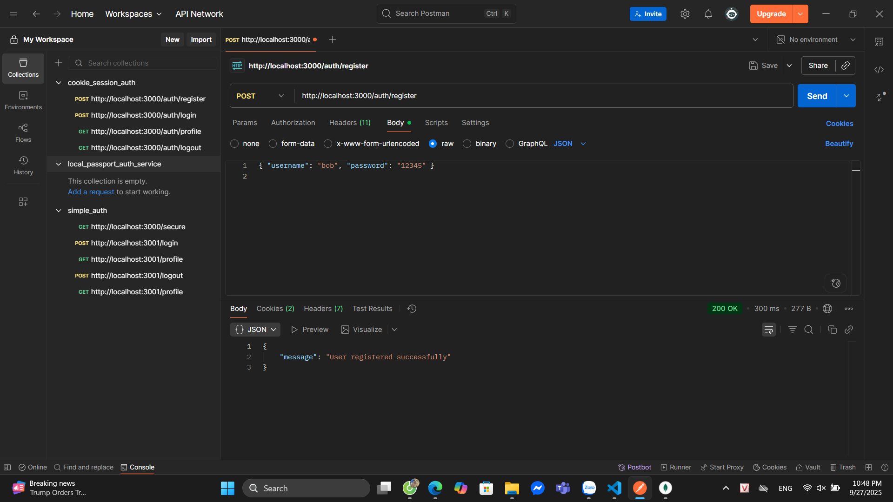
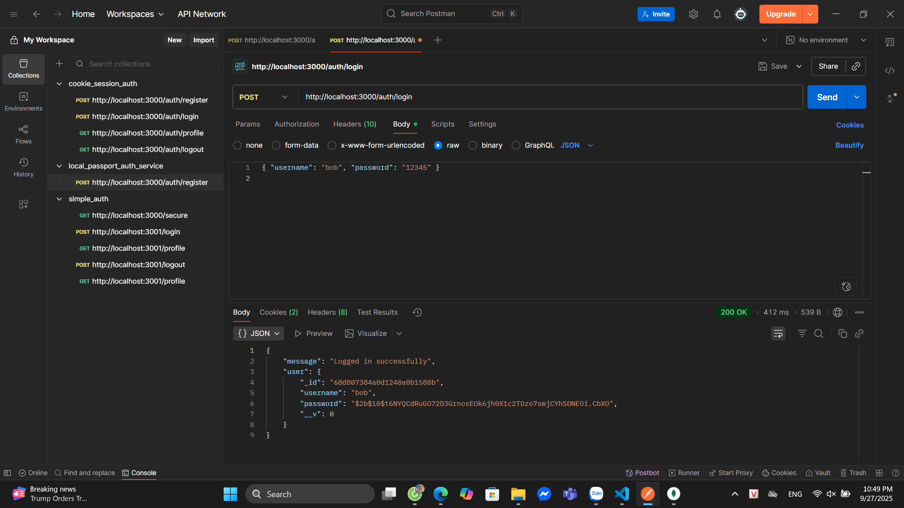
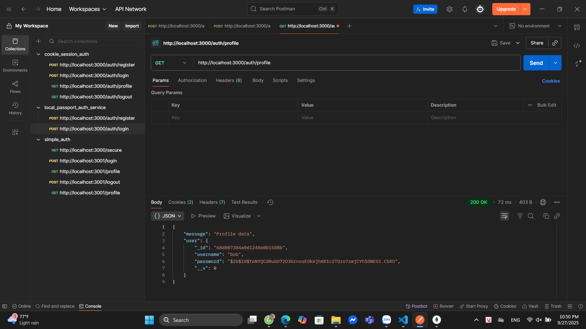
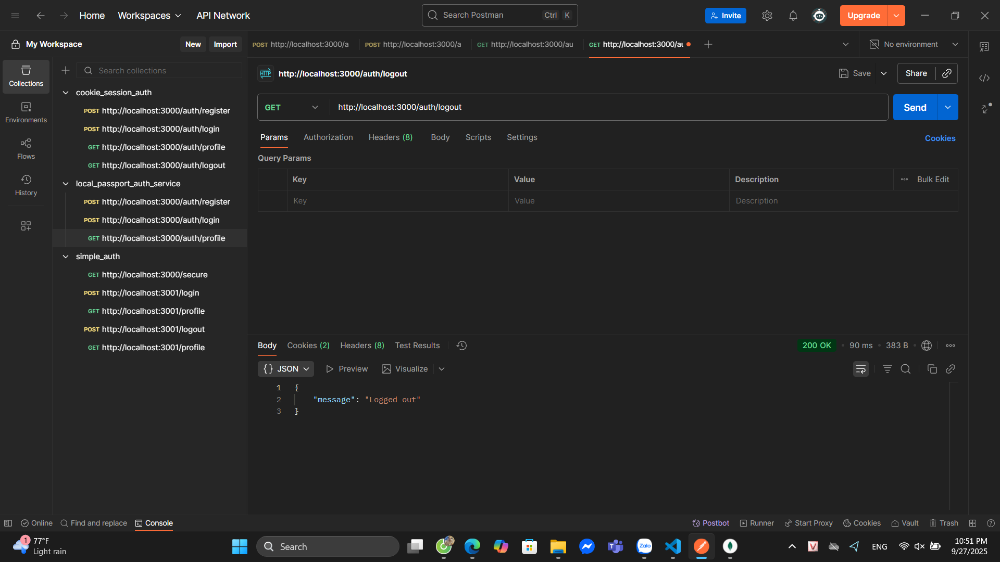

# local_passport_auth_service (LAB: Security in NodeJS)

## How to run
```bash
npm install
node app.js
```
MongoDB phải chạy trước (local hoặc docker).

---

## Endpoints & How to test (POSTMAN)

### Register
POST `http://localhost:3000/auth/register`  
Body JSON:
```json
{ "username": "bob", "password": "12345" }
```
Expected: `User registered successfully`  


---

### Login
POST `http://localhost:3000/auth/login`  
Body JSON:
```json
{ "username": "bob", "password": "12345" }
```
Expected: `Logged in successfully`  


---

### Profile
GET `http://localhost:3000/auth/profile`  
Expected: Profile data with user info  


---

### Logout
GET `http://localhost:3000/auth/logout`  
Expected: `Logged out`  


---

## Commit & push lên GitHub
```bash
git init
git add .
git commit -m "Local passport auth lab"
git remote add origin https://github.com/<your-username>/local_passport_auth_service
git branch -M main
git push -u origin main
```
